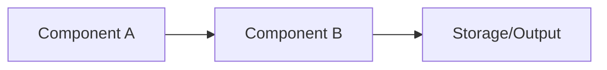

# Codebase Overview Template

This template provides the structure for explaining HOW an area works technically—architecture, components, design
patterns, and implementation details.

---

## Template Structure

```markdown
# [AREA_NAME]: Codebase Overview

**Last Updated:** [DATE]

For product context, see [product_overview.md](./product_overview.md). See [../glossary.md](../glossary.md) for terms.

---

## Architecture Overview

[Start with a diagram showing the major components and their relationships]

```
                        ┌───────────────────┐
                        │    [TOP_LAYER]    │
                        └─────────┬─────────┘
                                  │
          ┌───────────────────────┼───────────────────────┐
          ▼                       ▼                       ▼
   ┌─────────────┐         ┌─────────────┐         ┌─────────────┐
   │ COMPONENT_1 │         │ COMPONENT_2 │         │ COMPONENT_3 │
   └─────────────┘         └──────┬──────┘         └─────────────┘
                                  │
                                  ▼
                       ┌────────────────────┐
                       │   [BOTTOM_LAYER]   │
                       └────────────────────┘
```

[2-3 paragraphs explaining the architecture at a high level:]
- What are the major layers?
- How do requests/data flow through the system?
- What are the key boundaries?

---

## Core Components

### [COMPONENT_1_NAME] (`[directory/]`)

**What it is:** [One-line description]

**Key responsibilities:**
- [Responsibility 1]
- [Responsibility 2]
- [Responsibility 3]

**Key files/classes:**
- `[FileName.ext]` — [Purpose]
- `[FileName2.ext]` — [Purpose]

**How it works:**
[2-3 paragraphs explaining the internals. Include:]
- Main entry points
- Key algorithms or patterns
- Important data structures

### [COMPONENT_2_NAME] (`[directory/]`)

[Repeat pattern for each major component]

---

## Component Interactions

[Show how components communicate or depend on each other. Adapt to your architecture style.]

### For Service-Oriented Architectures

**[INTERACTION_NAME] Flow:**
```
[SERVICE_A] → [PROTOCOL] → [SERVICE_B] → [PROTOCOL] → [SERVICE_C]
     │                          │                          │
     └── [what happens] ────────┴── [what happens] ────────┘
```

### For Layered/Library Architectures

**Dependency Flow:**
```
[CONSUMER_LAYER]
       │
       │ uses
       ▼
[ABSTRACTION_LAYER]  ←── defines interfaces
       │
       │ implemented by
       ▼
[IMPLEMENTATION_LAYER]
```

### [SPECIFIC_INTERACTION_NAME]

**What happens:**
1. [Step 1]
2. [Step 2]
3. [Step 3]

**Key details:**
- [Detail 1]
- [Detail 2]

---

## Data Model

[If there's a significant data model, document it]

### Key Entities

| Entity      | Description   | Storage        |
|-------------|---------------|----------------|
| [ENTITY_1]  | [Description] | [Where stored] |
| [ENTITY_2]  | [Description] | [Where stored] |

### Relationships

[Describe how entities relate to each other]

---

## Technology Stack

| Category  | Technology  | Purpose              |
|-----------|-------------|----------------------|
| Language  | [LANG]      | [Why this language]  |
| Framework | [FRAMEWORK] | [What it provides]   |
| Database  | [DB]        | [What it stores]     |
| Messaging | [QUEUE]     | [What flows through] |
| Protocol  | [PROTOCOL]  | [Why this choice]    |

---

## Design Patterns

[Document recurring patterns in this area]

### [PATTERN_1_NAME]

**What it is:** [Brief description of the pattern]

**Where it's used:** [Components that use this pattern]

**Why it's used:** [Problem it solves]

**Example:**
```[language]
// Brief code example showing the pattern
```

### [PATTERN_2_NAME]

[Repeat pattern]

---

## Configuration

### Key Configuration Files

| File              | Purpose              |
|-------------------|----------------------|
| `[config_file_1]` | [What it configures] |
| `[config_file_2]` | [What it configures] |

### Important Settings

| Setting      | Default | Description         |
|--------------|---------|---------------------|
| [SETTING_1]  | [VALUE] | [What it controls]  |
| [SETTING_2]  | [VALUE] | [What it controls]  |

---

## Internal Names

[Codenames, jargon, and acronyms specific to this area]

- **[NAME_1]**: [What it actually means]
- **[NAME_2]**: [What it actually means]

See also: [../glossary.md](../glossary.md)

---

## Important Links

**External:**
- [TECH_1 Docs](https://...) — [Why relevant]
- [TECH_2 Docs](https://...) — [Why relevant]

**Internal Code:**
- `[dir1/]` — [What's here]
- `[dir2/]` — [What's here]

**Related Docs:**
- [Product Overview](./product_overview.md)
- [Glossary](../glossary.md)
- [Main Overview](../[main_overview].md)

---

## Documentation Scope

This document provides a high-level architectural overview of [AREA_NAME]. It covers major components and their
interactions but does not detail internal implementation of each component.

**What's covered:** Architecture, component responsibilities, key patterns, technology choices

**What's not covered:** Detailed implementation, edge cases, performance tuning, all configuration options

**To go deeper:** Start a new AI session using the
[Expanding Documentation Prompt]([METHODOLOGY_URL]/blob/main/LOADER.md#expanding-documentation-prompt), asking to
drill into specific components or flows within this area.

**Existing codebase documentation:** [Link to any existing docs in the codebase that cover this area]

**Parent document:** [Link to Main Overview or parent area doc]
```

---

## Writing Tips

1. **Lead with the diagram** — A picture is worth 1000 words of prose

2. **Use tables for reference material** — Components, technologies, settings

3. **Explain "why" not just "what"** — "Uses Kafka because..." > "Uses Kafka"

4. **Include actual file/class names** — Makes the doc actionable

5. **Don't exhaustively list everything** — Focus on what matters for understanding

6. **Link to external docs** — Don't re-explain Kafka, link to its docs

7. **Document internal names prominently** — These are the vocabulary for reading code

8. **Keep tone professional and factual** — Avoid editorializing ("elegant", "powerful", "seamlessly"). State what
   things do, not how impressive they are.

9. **Link to existing codebase docs** — If the codebase has its own documentation for this area, link to it rather
   than duplicating.

---

## Diagram Tips

**ASCII diagrams** work well and render everywhere:
```
┌─────┐     ┌─────┐
│  A  │────▶│  B  │
└─────┘     └─────┘
```

**Mermaid diagrams** are richer but need renderer support:


**Keep diagrams focused** — One diagram per concept. A diagram with 50 boxes helps no one.
